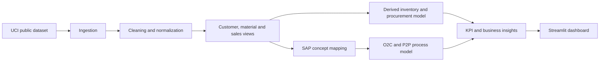

# SmartERP Insights

**SAP-oriented sales, inventory and process analytics for a retail business.**

This is an educational analytics project for an ERP-SAP interview. It models SAP concepts; it does not connect to or execute transactions in SAP.

## Business problem
Management wants to understand revenue concentration, customer performance, stock risk, overstock, and replenishment priorities. The project connects cleaned retail transactions to simplified Order-to-Cash (O2C) and Procure-to-Pay (P2P) workflows.

## Public dataset
Source: [UCI Online Retail](https://archive.ics.uci.edu/dataset/352/online+retail). The application downloads the workbook into `data/raw/` on first run. Source fields used are invoice number, stock code, description, quantity, invoice date, unit price, customer ID and country. The dataset does not contain inventory, supplier, delivery, payment, plant or storage-location records.

Inventory is therefore derived transparently: opening stock is two months of average demand, safety stock is 0.5 months, reorder level is demand plus safety stock, target stock is reorder level plus one month of demand, goods issued is one modeled month of demand, and current stock is opening stock plus simulated goods received minus goods issued. Supplier `SIM-DEFAULT`, plant `UK01`, and storage location `0001` are simulation fields. Suggested purchase quantity is `max(0, target_stock - current_stock)`.

## Architecture


## Folder structure
- `app.py`: Streamlit pages and visualizations.
- `src/data_pipeline.py`: ingestion, cleaning, derived inventory, SQLite export and KPIs.
- `src/config.py`: paths and public dataset URL.
- `tests/test_pipeline.py`: focused rules for cleaning, inventory arithmetic and KPI contracts.
- `CHALLENGES.md`: implementation challenges grounded in this project.
- `METHODOLOGY.md`: step-by-step method, data model and assumptions.
- `INTERVIEW_GUIDE.md`: short interview answers plus explanations.
- `RESUME.md`: final resume bullets based on the implemented scope.

## Run
```powershell
python -m pip install -r requirements.txt
streamlit run app.py
```
The first run needs internet access to download the UCI workbook. The pipeline also writes a local SQLite analytical database at `data/processed/smarterp.db`.

## SAP mapping boundary
Customers map to Customer Master/Business Partner, products to Material Master, sales to SAP SD, inventory and procurement to SAP MM, and revenue to a billing/FI integration discussion. O2C and P2P are simplified educational process models. No SAP GUI, API, BAPI, IDoc, posting, or configuration was used.
