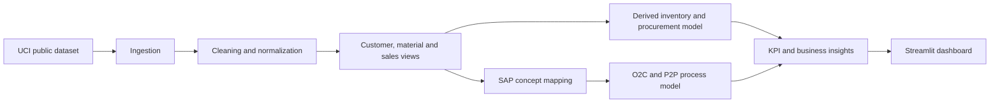

# SmartERP Insights

**SAP-oriented sales, inventory and process analytics for a retail business.**

This is an educational analytics project for an ERP-SAP interview. It models SAP concepts; it does not connect to or execute transactions in SAP.

## Project at a glance

- **Problem:** Connect sales demand with inventory and procurement decisions.
- **Dataset:** Public UCI Online Retail dataset.
- **Technology:** Python, Pandas, NumPy, SQLite, Plotly and Streamlit.
- **SAP areas:** SAP SD, SAP MM and basic FI integration concepts.
- **Business processes:** Order-to-Cash (O2C) and Procure-to-Pay (P2P).
- **Output:** A management-facing dashboard for sales, inventory, procurement and data-quality analysis.

## Business problem
Management wants to understand revenue concentration, customer performance, stock risk, overstock, and replenishment priorities. The project connects cleaned retail transactions to simplified Order-to-Cash (O2C) and Procure-to-Pay (P2P) workflows.

## Public dataset
Source: [UCI Online Retail](https://archive.ics.uci.edu/dataset/352/online+retail). The application downloads the workbook into `data/raw/` on first run. Source fields used are invoice number, stock code, description, quantity, invoice date, unit price, customer ID and country. The dataset does not contain inventory, supplier, delivery, payment, plant or storage-location records.

Inventory is therefore derived transparently: opening stock is two months of average demand, safety stock is 0.5 months, reorder level is demand plus safety stock, target stock is reorder level plus one month of demand, goods issued is one modeled month of demand, and current stock is opening stock plus simulated goods received minus goods issued. Supplier `SIM-DEFAULT`, plant `UK01`, and storage location `0001` are simulation fields. Suggested purchase quantity is `max(0, target_stock - current_stock)`.

All monetary values are represented in GBP because the source dataset is from a UK-based retailer. Source transaction fields are kept separate from derived revenue, demand and inventory calculations, and simulated supplier, plant and storage-location fields.

## Verified results

- 392,732 cleaned transaction records
- 18,536 invoices
- 3,665 materials
- 4,339 customers
- GBP 8.89M total revenue in the analytical view
- 2,278 materials flagged for replenishment review by the derived model

## SAP business mapping

| Business area | SAP concept | Project representation |
| --- | --- | --- |
| Sales | SAP SD | Invoice and customer sales analysis |
| Inventory | SAP MM | Derived stock, goods issue and plant fields |
| Procurement | SAP MM Purchasing | Replenishment review and purchase suggestion |
| Billing | SAP SD with FI integration | Revenue and billing analytical proxy |
| Master data | Customer, Material and Vendor Master | Normalized customer/material and simulated supplier views |
| Analytics | SAP-oriented reporting | KPI dashboard and business insights |

## Process scope

**Order-to-Cash:** Customer -> Sales Order -> Availability Check -> Delivery -> Goods Issue -> Billing -> Payment. Source invoices and customers provide analytical evidence for selected stages; delivery and payment are conceptual because they are not present in the source.

**Procure-to-Pay:** Low Stock -> Purchase Requisition -> Purchase Order -> Goods Receipt -> Supplier Invoice -> Payment. Low-stock status and purchase suggestions are derived; supplier invoices and payments are not present in the source.

The project models SAP concepts and document relationships. It does not connect to SAP, execute transactions, create master records, post financial documents, or claim SAP system access.

## Architecture


## Folder structure
- `app.py`: Streamlit pages and visualizations.
- `src/data_pipeline.py`: ingestion, cleaning, derived inventory, SQLite export and KPIs.
- `src/config.py`: paths and public dataset URL.
- `tests/test_pipeline.py`: focused rules for cleaning, inventory arithmetic and KPI contracts.
- `requirements.txt`: Python dependencies.

## Run
```powershell
python -m pip install -r requirements.txt
streamlit run app.py
```
The first run needs internet access to download the UCI workbook. The pipeline also writes a local SQLite analytical database at `data/processed/smarterp.db`.

## Limitations

The source dataset does not contain an actual stock ledger, suppliers, delivery dates, payment records, tax, currency conversion, plant, storage location or SAP document numbers. Inventory and procurement findings are therefore educational estimates that should be reconciled with real SAP material, plant, storage-location and movement data before operational use.
